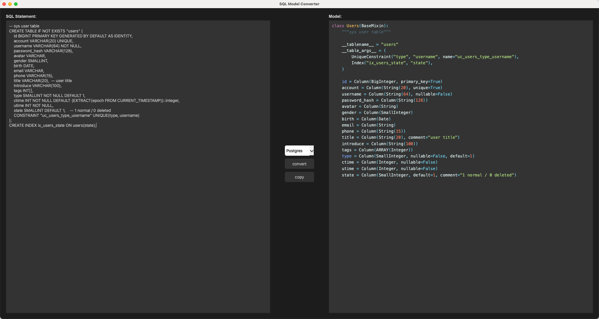

# SQL2Model
<div align="center">
 
<div> Convert SQL DDL statements to SQLAlchemy model</div>
</div>


# Features
- Use sqlglot to parse SQL
- Pyside6 GUI 
- Highlight python output  
- Supported SQL dialects: `postgresql` `mysql` `sqlite`

  
**Example**


# Deployment
```shell
# using uv
uv sync
source .venv/bin/activate

# or
uv pip install -r requirements.txt

python3 sql2model.py

```
  

# How to package a program as dmg
1. run `python3 gen_icons.py` to generate icons file for macos
2. run `pyinstaller sql2model.py -w --clean -i ./assets/Icon.icns --distpath /Users/admin/data/resources/app/sql2model/sql2model_release0.1.0 --add-data /Users/admin/data/resources/app/sql2model/sql2model_release0.1.0:resources`
(resources is a static dir)  
  

# FIXME
There may be unknown bugs because not all SQL syntax has been tested